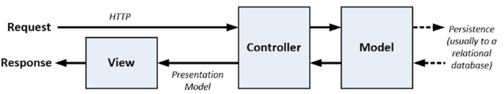
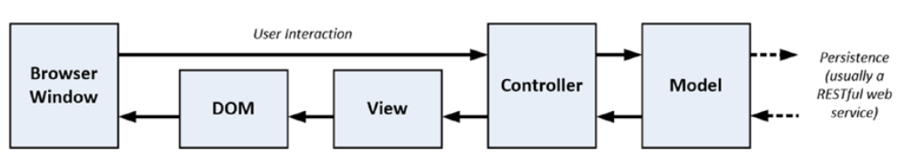
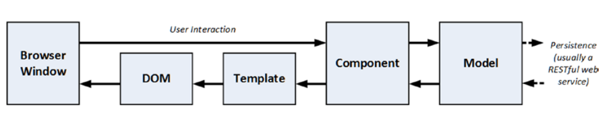

## 第三章：Putting Angular in Context
让原本在服务端做的工作转移到前端来，构建你的Angular Web复杂应用吧！

* 更容易开发、测试、维护。
* 允许扩展自定义HTML。
* 典型的MVC模式。

### 关于Angular和本书的更新

* 2017.3发布ng4，2017.9发布ng5，没有ng3，所有更新都是向后兼容的。
* 本书的git仓库会随之更新。
* 想联系作者请发邮件给 adam@adam-freeman.com。

### Angular擅长的地方
ng并不是随处适用，你在技术选型的时候需要考虑一下。

* 复杂。比如编译HTML，评估数据绑定，组件和模块需要被执行等等。
* 对于老式浏览器和设备支持性不是很好。
* 适合开发单页应用（single-page.）

#### 理解单页应用和往返应用
Angular适合用来开发单页应用，但也可以结合JQ等操作DOM的库开发复杂的往返应用。
##### 往返应用
* 传统前后端交互，大部分逻辑和数据在服务器端。
* 缺点：用户等待时间长，耗费网络带宽。

##### 单页应用
* 前后端通过ajax异步交互，客户端承载了部分逻辑和数据。
* 优点：用户等待时间短，节省网络带宽

##### Angular和JQuery
它们的工作方式不同，一个是操作DOM，一个是和指派浏览器成为网络应用开发的平台。

* JQ操作DOM非常方便，但不适用构建大型网络应用。
* JQ难以进行单元测试。
* NG的学习成本大。但方便应用的后期维护。

### 理解MVC模式
MVC模式最初在1970年代出现，用于服务端。

* 特别适用于Web应用。
* 关键是分层：数据模型、业务逻辑、表现。
* 使程序更易开发、维护和测试。
* 模式的确很好，但是要灵活选择，忽略模式狂热者。

>服务端实现的MVC，客户端发HTTP请求给服务端，服务端控制视图，视图控制DOM，数据从数据库里取。

>客户端实现的MVC，控制器管理视图，视图控制DOM，数据是restful的方式取。

>Angular实现的MVC，组件管理模板，模板控制DOM，数据是restful的方式取。

Angular不排斥服务端MVC模式。

#### 理解Models
Models包含了用户所需的数据。一种是视图模型，一种是域模型。

* 视图模型仅仅把数据传给组件和模板。
* 域模型包括数据以及相关的操作、转换和规则。
* MVC是域模型，它三个层面都有数据和操作。
* MVC的Models的目的就是管理数据。
* Models会包含业务逻辑
* Models应该包含：

	1.域数据。
	2.创建、修改、管理域数据的逻辑。（即使它是通过服务器端执行）
	3.一个暴露模型数据并且能够操作它的API。

* Models不应该包含：

	1.模型数据被管理的细节。
	2.基于用户交互的模型变化逻辑。（它是组件的工作）
	3.展示数据的逻辑。（它是模板的工作）
* 好的Models可以进行数据的CRUD操作，或者符合命令和查询职责分离（CQRS）模式。甚至可以通过restful调用服务端的数据库。

> 迁移angular1.x
https://angular.io/docs/ts/latest/guide/upgrade.html		

#### 理解Controllers/Components
它是Model和View的桥梁。通常负责业务域逻辑。

* Components应该包含：

	1.模板初始化的逻辑。
	2.模板从模型展现数据的逻辑。
	3.基于用户交互更新模型的逻辑。（我的理解是事件等）

* Components不应该包含：
	
	1.操作DOM的逻辑。（这是模板的工作）
	2.管理数据持久性的逻辑。（这是模型的工作）

#### 理解View Data
组件能够创建视图模型去简化模板和视图之间的交互。（？有点不明白）

#### 理解Views/Templates
使用HTML元素和数据绑定将web应用变得动态、灵活起来。

* Template应该包含：

	1.数据呈现给用户所需的逻辑和标签。

* Template不应该包含：
	
	1.复杂的逻辑。（最好交给组件或ng内部模块比如指令、服务或者管道去做。）
	2.创建、存储或者操作域模型的逻辑。

### 理解RESTful服务
RESTful（一种API风格） web 服务采用ajax的方式使得客户端和服务端解耦。

* RESTful支持GET/POST/PUT/DELETE四种HTTP方法。（在这里提了一下幂等：调用一次和多次效果一样）

### 常见的设计失误

* 把逻辑放在错误的地方
为了避免将来应用变得难以维护和测试，你需要：

	1.将业务逻辑放在模板中，而不是在组件中。
	2.将域逻辑放在组件中，而不是模型中。
	3.在使用RESTful服务时将数据存储逻辑放在客户端模型中。

	三条原则：

	1.模板的逻辑应该只为展现数据而不会修改模型。
	2.组件的逻辑不应该直接创建、更新或删除数据模型。
	3.模板和组件不应该直接访问数据存储区。（通过provider的单例吗？）

* 采用数据存储数据格式（Adopting the Data Store Data Format）（？？？）

当服务端更新了关键数据类型客户端要知道如何应对。原则是使用RESTful服务。

* 没学好就干就是给自己挖坑
Angular很复杂，你需要慢慢学，熟悉了特性再用，不然全是坑。

### 总结
作者简单地介绍了一下ng，包括适合什么情景使用，什么情景不用，MVC模式和ng的关系，REST的简介和它使用HTTP表示数据操作的请求。还有三个最常见的设计失误。
>下一章，作者提供了一个例子供HTML和Bootstrap的快速入门。