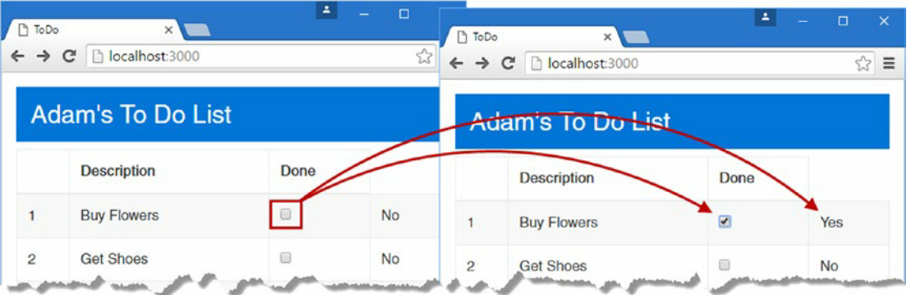
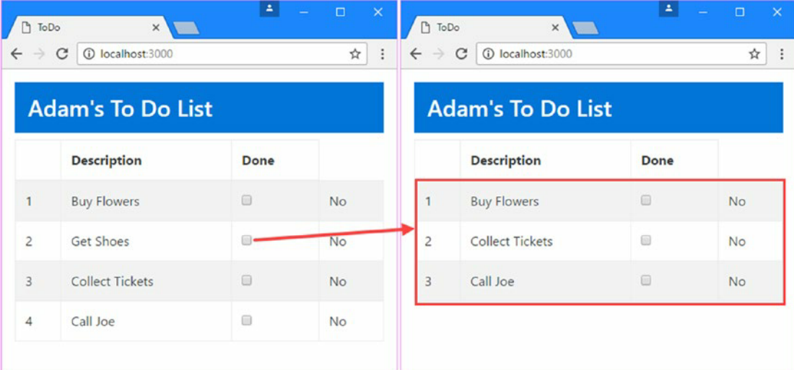

## 第二章：Your First Angular App
实践是最好的！这章会教你搭建环境。因为Angular的学习曲线很陡峭，所以先有个基本印象，然后再一步步构建复杂的应用。
### 环境搭建
* 安装nodejs，版本是6.9.1 https://nodejs.org/dist/v6.9.1
* 检查环境,提示版本号则安装成功
```bash
node -v
```
* 安装npm
```bash
npm install -g npm@3.10.9
```
* 安装一个编译器，可选择Sublime、Atom、Bracket、WebStorm、VS Code
* 安装浏览器，推荐Chrome

### 项目起步
例子为一个Todo List
#### 新建package.json依赖包
```bash
{
  "dependencies": {
    "@angular/common": "2.2.0",
    "@angular/compiler": "2.2.0",
    "@angular/core": "2.2.0",
    "@angular/forms": "2.2.0",
    "@angular/platform-browser": "2.2.0",
    "@angular/platform-browser-dynamic": "2.2.0",
    "reflect-metadata": "0.1.8",
    "rxjs": "5.0.0-beta.12",
    "zone.js": "0.6.26",
    "core-js": "2.4.1",
    "classlist.js": "1.1.20150312",
    "systemjs": "0.19.40",
    "bootstrap": "4.0.0-alpha.4"
  },
  "devDependencies": {
    "lite-server": "2.2.2",
    "typescript": "2.0.3",
    "typings": "1.4.0",
    "concurrently": "3.1.0"
  },
  "scripts": {
    "start": "concurrently \"npm run tscwatch\" \"npm run lite\" ",
    "tsc": "tsc",
    "tscwatch": "tsc -w",
    "lite": "lite-server",
    "typings": "typings"
  }
}
```

* 第11章会解释上面那个文件
* dependencies：应用所依赖的Angular核心包、库
* devDependencies：应用不需要立刻依赖的包
* scripts：能够从命令行运行的命令，可以执行ts编译、http服务器开启等

#### 安装npm包
```bash
npm install
```
#### 配置typescript编译器
* 第6章详细介绍ts的特点
* 在tsconfig.json里配置,第11章解释代码

```bash
{
  "compilerOptions": {
    "target": "es5",
    "module": "commonjs",
    "moduleResolution": "node",
    "emitDecoratorMetadata": true,
    "experimentalDecorators": true
  },
  "exclude": [ "node_modules" ]
}
```
#### 安装typescript类型信息
```bash
npm run typings -- install dt~core-js --save --global
npm run typings -- install dt~node --save --global
```
接着typings.json文件里就会有相关信息

#### 新建HTML文件
index.html

```bash
<!DOCTYPE html>
<html>
<head>
    <title>ToDo</title>
    <meta charset="utf-8" />
    <link href="node_modules/bootstrap/dist/css/bootstrap.min.css"
          rel="stylesheet" />
</head>
<body>
    <h1>Content will go here</h1>
</body>
</html>
```
#### 开启服务器
```bash
npm start
```
#### 替换HTML内容
* 由于服务器的开启，浏览器会自动重载
* BootStrap是一个非常好的框架，本书用的版本是4

### 把Angular融入项目中
让应用活过来~

#### 准备index.html
* 引入npm中的js文件

```bash
...
<script src="node_modules/core-js/client/shim.min.js"></script>
...
```

* 使用占位符

```bash
...
<todo-app>Angular placeholder</todo-app>
...
```

#### 新建一个数据模型
* 这个模型支持创建、加载、存储和修改数据对象。
* 作者在app目录下创建了model.ts文件
编译前的ts：
```bash
export class Model {
    user;
    items;
    constructor() {
        this.user = "Adam";
        this.items = [new TodoItem("Buy Flowers", false),
   		new TodoItem("Get Shoes", false),
        new TodoItem("Collect Tickets", false),
        new TodoItem("Call Joe", false)]
    }
}
export class TodoItem {
    action;
    done;
    constructor(action, done) {
        this.action = action;
        this.done = done;
    }
}
```
js写法:
```bash
var model = {
    user: "Adam",
    items: [{ action: "Buy Flowers", done: false },
        { action: "Get Shoes", done: false },
        { action: "Collect Tickets", done: true },
        { action: "Call Joe", done: false }]
};
```
* ts的很多特性有助于帮助我们开发js，因为它吸收了其他语言如C#，JAVA的好处。
* export实现模块化。
	ts编译成js实现的模块化：
```bash
"use strict";
var Model = (function () {
    function Model() {
        this.user = "Adam";
        this.items = [new TodoItem("Buy Flowers", false),
            new TodoItem("Get Shoes", false),
            new TodoItem("Collect Tickets", false),
            new TodoItem("Call Joe", false)];
    }
    return Model;
}());
exports.Model = Model;
var TodoItem = (function () {
    function TodoItem(action, done) {
        this.action = action;
        this.done = done;
    }
    return TodoItem;
}());
exports.TodoItem = TodoItem;
```

#### 新建一个模板
本质上它是一个包含了ng指令的HTML片段。
> app.component.html

```
<h3 class="bg-primary p-a-1">{{getName()}}'s To Do List</h3>
```

* 数据绑定: `{{}}`


#### 新建一个组件
组件负责管理模板，并且提供所需的数据和逻辑。
> app.component.ts

```
import { Component } from "@angular/core";
import { Model } from "./model";
@Component({
    selector: "todo-app",
    templateUrl: "app/app.component.html"
})
export class AppComponent {
    model = new Model();
    getName() {
        return this.model.user;
    }
}
```

#### 理解 Imports
Imports关键字用于声明依赖的模块。

* 从模块中加载所需要的内容。
* 不包含文件扩展名。
* 由模块加载器管理。

#### 理解 Decorator
Decorator提供一个类的相关元数据。
> Component装饰器

```
@Component({
    selector: "todo-app",
    templateUrl: "app/app.component.html"
})
```

* 通过属性配置。
* 装饰器模式被ng广泛支持。

#### 理解 Class
Class定义了面向对象中的类，可以具有属性和方法，它提供了数据给template。
> AppComponent Class

```
export class AppComponent {
    model = new Model();
    getName() {
        return this.model.user;
    }
}
```

### 组装项目的各个部分

* 第一步：新建一个ng模块,这是整个应用的入口。它通过属性来配置，由ngModule装饰器定义。

> app.module.ts 

```
import { NgModule } from "@angular/core";
import { BrowserModule } from "@angular/platform-browser";
import { FormsModule } from "@angular/forms";
import { AppComponent } from "./app.component";
@NgModule({
    imports: [BrowserModule, FormsModule],
    declarations: [AppComponent],
    bootstrap: [AppComponent]
})
export class AppModule { }

```

* 第二步：新建一个引导模块
它包含了启动应用所需的代码和加载ng模块。除了支持web平台还可以跨平台。

> main.ts

```
import { platformBrowserDynamic } from '@angular/platform-browser-dynamic';
import { AppModule } from './app.module';
platformBrowserDynamic().bootstrapModule(AppModule);
```

* 最后一步：修改HTML文件
当应用被启动时，相关代码将会被加载进去。

> index.html 新增部分

```
var paths = {
            "rxjs/*": "node_modules/rxjs/bundles/Rx.min.js",
            "@angular/*": "node_modules/@angular/*"
        }
var packages = { "app": {} };
var angularModules = ["common", "compiler", "core", "forms",
    "platform-browser", "platform-browser-dynamic"];
angularModules.forEach(function (pkg) {
    packages["@angular/" + pkg] = {
        main: "/bundles/" + pkg + ".umd.min.js"
    };
});
System.config({ paths: paths, packages: packages });
System.import("app/main").catch(function(err){ console.error(err); });

```

### 启动项目
bootstrap文件->html文件和todo-app组件->匹配selector替换原来的默认内容->加载app.component.html并解析->进行数据绑定->渲染页面

### 给项目添加新的特性
#### 添加TO-DO表

> app.component.ts

```
getTodoItems() {
        return this.model.items;
}
```
> app.component.html

```
<table class="table table-striped table-bordered">

    <thead>
        <tr><th></th><th>Description</th><th>Done</th></tr>
    </thead>
    <tbody>
        <!-- *ngFor指令用来遍历，i是索引 -->
        <tr *ngFor="let item of getTodoItems(); let i = index">
            <!-- 数据绑定，支持简单的表达式，复杂的可以用管道操作 -->
            <td>{{ i + 1 }}</td>
            <td>{{ item.action }}</td>
            <!-- *ngSwitch指令是一个条件语句 -->
            <td [ngSwitch]="item.done">
                <span *ngSwitchCase="true">Yes</span>
                <span *ngSwitchDefault>No</span>
            </td>
        </tr>
    </tbody>
</table>
```
#### 创建双向数据绑定
双向数据绑定既可显示或更新数据。常常用于表单元素。

```
<td><input type="checkbox" [(ngModel)]="item.done" /></td>
```


#### 过滤数据
当item的状态是done的时候过滤掉。

```
<!-- 匿名函数 -->
return this.model.items.filter(item => !item.done);
```


#### 新增数据
允许用户新增item。
```
<div class="m-t-1 m-b-1">
    <!-- #todoText代表模板变量，绑定了它所在dom元素 -->
    <input class="form-control" #todoText />
    <!-- 这里涉及到了事件绑定 -->
    <button class="btn btn-primary m-t-1" (click)="addItem(todoText.value)">
        Add
    </button>
</div>
```
```
addItem(newItem) {
        if (newItem != "") {
            this.model.items.push(new TodoItem(newItem, false));
        }
}
```
### 总结
这一章我们创建了一个简单的Angular TO-DO LIST，记住最关键的三个部分：数据模型，组件，模板。其他的部分以后会详细描述。


<!-- More info on this can be found on the Ionic [链接](http://ionicframework.com/docs/v2/getting-started/) page. -->
