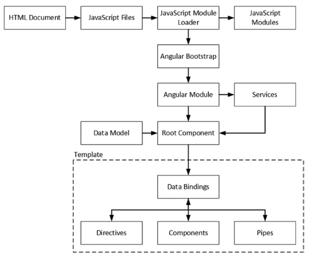

## Creating an Angular Project


| 问题 | 解决方案 | 列表 |
| --- | --- | --- | 
| 准备一个HTML文件到ng应用里去 | 增加一个自定义元素，通常是<app></app>| 1 |
| 增加应用所需的包和安装 | 创建package.json文件和使用 npm install命令 | 2-3 | 
| 提供有类型注解的TS编译器 | 使用 typings 命令下载安装这种数据 | 4 | 
| 配置TS编译器 | 创建tsconfig.json文件 | 5-7 | 
| 确保浏览器在监听变化 | 使用像lite-server的包起一个HTTP服务器 | 8-9 | 
| 创建一个简单的ng应用 | 创建一个数据模型、一个根组件、一个根模块和一个引导文件 | 10-16 | 
| 确保依赖的模块能被解析 | 配置JS模块加载器 | 10-16 | 


### 准备一个TS的NG开发应用
在第二章的基础上深入为什么我们要那样做。

#### 创建项目文件结构
最基本的NG项目只有两个文件夹，一个包含项目代码，一个包含NG代码。就像src和src/app

#### 创建和服务HTML文档
index.html是根HTML文件，用一个标签先占位，以后的内容都从这里展现。

#### 准备应用配置
package.json有三个部分：dependencies依赖，devDependencies环境依赖，scripts命令快捷

#### 添加包
各个包的版本一定要对。

##### 理解依赖包

* @angular/* NG的各种模块
* reflect-metadata 检测类上的装饰器的API
* rxjs 响应式拓展包，用来实现NG变值检测系统，比如数据绑定，也可以直接使用
* zone.js 提供了异步任务的执行上下文，用来评估模板表达式
* core-js 提供了旧式浏览器不支持的功能
* classlist.js 提供了IE9不支持的功能
* systemjs	模块加载器，将会在配置JS模块加载器详解
* bootstrap UI框架

##### 理解开发环境依赖包

* lite-server 提供开启HTTP服务
* typescript 提供TS特性以及TS编译器
* typings 把JS库转成TS
* concurrently 同时运行多个npm命令

#### 设置TS

TS的强类型让开发很爽，至少作者是这样的，所以首先typing...

```
npm run typings -- search core-js
npm run typings -- install dt~core-js --save --global
```

##### 配置TS编译器
tsconfig.json,有两个部分：compilerOptions和exclude

* target 要编译的JS版本，一般是es5
* module 模块加载规范，一般使用commonjs，SystemJS是支持它的
* moduleResolution 设置编译器处理import的方式，一般从NPM里找
* emitDecoratorMetadata 让编译器包括使用reflect-metadata的装饰器信息
* experimentalDecorators emitDecoratorMetadata所需要的
* exclude 告诉编译器什么需要被忽略
* 作者创建了一个简单的ts文件测试编译npm run tsc

#### 配置开发的HTTP服务
使用 lite-server，基于BrowserSync包，可以检测代码变化和重载浏览器内容。
```
npm run lite
```

* 在浏览器里查看源代码会看见
```
document.write("<script async src='...'><\/script>".replace("HOST", location.hostname));
```
* 服务器会发一个信号给浏览器，多个浏览器同步刷新。
* 设置bs-config.js自动刷新，有ghostMode（多个浏览器同时刷新）、reloadDelay（刷新延迟）、reloadDebounce（刷新间隔）、injectChanges（注入）、minify（最小化js文件）等参数

#### 开启监听进程
让工作流流畅起来，一个命令代替多个命令。npm start足矣。

### 启动一个TS的NG开发应用


* HTML Document	应用的入口，一般是index.html
* JavaScript Files 常规的JS文件，即使用script标签引入的。
* Module Loader 载入NG模块和其他模块的JS组件
* JavaScript Modules 被打包成可以被模块加载器管理，正确执行的JS文件。
* Angular Bootstrap 配置NG和识别NG模块的TS文件，用来启动应用
* Angular Module 根模块和附加模块
* Data Model 提供数据和访问的逻辑
* Root Component 应用的进入入口，生成动态内容展示给用户。
* Template 通过根组件展现内容的HTML
* Data Bindings 告诉NG如何动态加载内容，像数据值绑定和用户交互
* Directives 转换HTML元素从而生成动态内容的类
* Components 添加内容和特性到应用中的组件
* Pipes 格式化数据的类
* 然后就是文件结构目录，没什么说的。

#### 创建数据模型
远程提供该数据的API和本地处理的代码。

* 一个描述数据模型的类。
* 一个数据源用来加载数据，通常是服务器。
* 一个仓库用来操作数据。

##### 创建实体类

用来描述数据。

##### 创建数据源

假数据，通过HTTP获取。

##### 创建模型仓库

CRUD方法。使用数组存储是有道理的，一是方便迭代，二是方便返回。（Map和Object都会导致问题）

#### 创建模板和根组件
模板是HTML+数据绑定+指令+管道组成的。

##### 创建NG模块
用来描述应用信息的根模块。

NgModule装饰器代表了元数据。

* imports指定依赖项。
* declarations用于注册。
* bootstrap用于启动。

#### 引导应用
main.ts文件作为入口。platformBrowserDynamic动态加载文件。bootstrapModule方法开启应用。platformBrowserDynamic决定运行环境。

#### 配置JS模块加载器
import变成require。

* tsconfig.json配置很重要。
* systemjs.config.js也很重要，虽然目前的项目里没有。

##### 解析RXJS模块
在systemjs.config.js里完成。
```
var paths = {
    "rxjs/*": "node_modules/rxjs/bundles/Rx.min.js",
    "@angular/*": "node_modules/@angular/*"
}
```
##### 解析自定义模块
在systemjs.config.js里完成。
```
var packages = { "app":  {} };
```
##### 解析NG模块
在systemjs.config.js里完成。
```
var angularModules = ["common", "compiler",
    "core", "platform-browser", "platform-browser-dynamic"];
angularModules.forEach(function(pkg) {
    packages["@angular/" + pkg] = {
        main: "/bundles/" + pkg + ".umd.min.js"
    };
});
```
#### 应用配置参数
```
System.config({ paths: paths, packages: packages });
```

##### 更新HTML文档
引入各种script和link，然而自己的项目里没有，估计是变了。

##### 应用JS模块加载器
解释引入的配置文件。

##### 添加样式
就是Bootstrap的东西。

#### 运行应用
HTML->脚本->模块加载器->模块->入口->根组件->模板->数据绑定

### 总结
这章讲述了应用的创建、编译和展现。